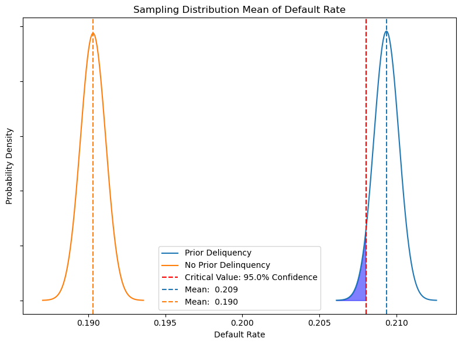
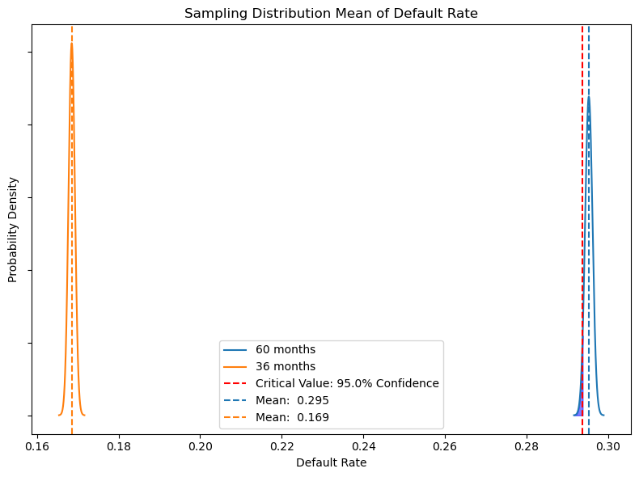
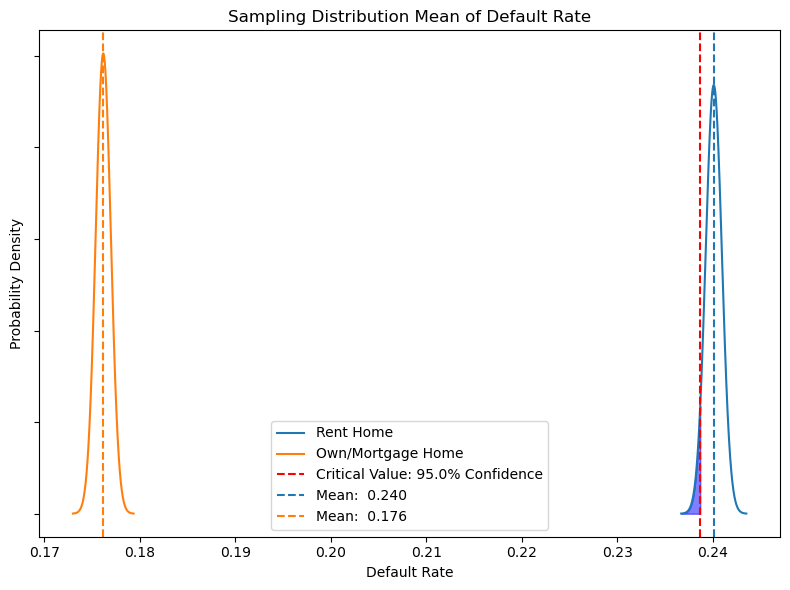

# DAI MIL Cohort #3 - Matthew Mark
 
 
 

# Lending Feature Analysis and Profit Optimization

***
 

## Table of Contents
- [Introduction](#introduction)
- [Overall](#overall)
- [Exploratory Data Analysis](#exploratory-data-analysis)
    - [Numerical Features](#numerical-features)
    - [Categorical Features](#categorical-features)
    - [Binary Features](#binary-features)
    - [Annual Income](#annual-income)
- [Hypothesis Testing](#hypothesis-testing)
    - [Prior Delinquency](#prior-delinquency)
    - [Loan Term Length](#loan-term-length)
    - [Home Ownership Status](#home-ownership-status)
- [Predictive Model](#predictive-model)
- [Conclusion](#conclusion)
 
 

***
## **Introduction**
***
The dataset (found [here](https://drive.google.com/file/d/1WFvu8dnVwZV5WuluHFS_eCMJv3qOaXr1/view)) used for this project contains feature data about applicants for personal loans as well as the end result of whether the borrower paid off or defaulted on the loan. The goal of the analysis was to understand the distrbution of the applicant data, analyze the factors that most affect default status, and build a model to predict whether a borrower will default on a loan to optimize lending practice and profit.
 
 

***
## **Overall**
***
After removing data entries with missing data and extreme outliers, twelve different features were used in the project analysis. One important note about this dataet is that it is imbalanced. The amount of loans that defaulted on payment is significantly smaller than the amount of loans that were paid back, as can be seen in the chart below. Loans that were paid off have been denoted as "Good Loans" while loans that defaulted have been denoted as "Bad Loans." It shows an average default rate of about 20%.
***

***
The amount of loans that were paid off outnumber the number of defaults 4:1. This is something that had to be accounted for during analysis and when building the prediction model. It is important to note that the model will be skewed toward predicting that a borrower will not default. Correcting this using methods for an imbalanced dataset tune the model to focus prediction on the default class.
 
 

***
## **Exploratory Data Analysis**
***
Each individual feature has its own distribution and impact on the end result of whether or not a borrower defaults on their loan. This next section focuses on visualizing each of these distributions to get a full understanding of the dataset.
 
 

### Numerical Features
***

 
 

### Categorical Features
***

 
 

### Binary Features
***

 
 

### Annual Income
***

 
 

It is important to note that during this data visualization process, data cleaning was used to remove extreme outliers that would have an abnormally large impact on the overall analysis. Each distribution of the feature data previously showed contains data from both good and bad loans in every category.
 
 

***
## **Hypothesis Testing**
***
After exploring the data, the next step was to use hypothesis testing to answer specific questions about how certain features impact the end result of defaulting on a loan. Since the end result is a predictive model, it is important to first understand if the feature variables have a significant impact on the end result. Using hypothesis testing, it can be determined if certain feature data is worth gathering on an individual applying for a loan. If that feature has a significant impact on the default rate, then it is worth the time to collect this data on individuals since it can grant insight on whether or not they will default on the loan.
 
 

### Prior Delinquency
***
The first hypothesis test assesed the difference in the default rate based on the binary feature of whether or not the applicant had a prior deliquency, or past unpaid debt. A one-tailed t test with 95% confidence was used to determine if applicants without a prior deliquency had a statstically lower default rate. Each distribution of the sample mean is a normal distribution centered around the sample mean and stretching 4 standard errors to each side. Based on repeated sampling from applicants with and without a prior deliquency, it was found that applicants without a prior deliquency were statistically less likely to default on loan payments.
***

 
 

### Loan Term Length
***
The second hypothesis test assesed the default rate given different lengths of the term of the loan. This feature was binned into just two categories in the dataset, 36 and 60 months. A one-tailed t test with 95% confidence was used to determine if applicants applying for a shorter term loan have a lower default rate than applicants applying for a longer term loan. Each distribution of the sample mean is a normal distribution centered around the sample mean and stretching 4 standard errors to each side. The test found that borrowers have a statistically lower default rate with a 36 month loan term than with a 60 month term. This is important because the company can potentially reduce risk by having more short-term loans, or charge a higher interest rate on loans that are longer term.
***

 
 

### Home Ownership Status
***
The third hypothesis test assesed the default rate given different home ownership status. The categories of owning and mortgaging a home were grouped together to compare to those borrowers who rent a home. A one-tailed t test with 95% confidence was used to determine if applicants who own or mortgage a home have a lower default rate than applicants who rent their home. Each distribution of the sample mean is a normal distribution centered around the sample mean and stretching 4 standard errors to each side. The test found that borrowers who own or mortgage their home have a statistically lower default rate than those who rent their home.
***

 
 

***
## **Predictive Model - Test Set**
***
The goal of the predictive model is to be able to maximize overall profit gained from loaning money to the applicants. Each loan that is paid back gives a certain amount of revenue, and each loan given out that is not paid back results in a cost. Arbitrary numbers were used for the sake of building the model, but real numbers could be easily inserted in a real business case. 

The first step in building the model was to create dummy variables for all categorical columns. Once all of these columns ahve a binary value, the train-test split was completed to create the test set and the holdout set. The test set was further split into the training set and the test set against which to test the model before ever seeing the holdout set to prevent data leakage. The training and test set were normalized and all features were included in creating the logistic regression model. The model produced the predictions for each category in the matrix below.
***

 
 

Since the goal of the model is to maximize profit, its performance must be compared to the opposite outcomes of giving out loans to all applicants, and giving out no loans to applicants. It must outperform both of these scenarios in order to bring produce value. Given that $10,000 is made in interest for every loan that is paid back, and $25,000 is lost for every loan that accrues a default, the model can be optimized for a maximum profit given a varying decision threshold. The final model produced the numbers shown in the table below.
***

 
 

***
## **Predictive Model - Holdout Set**
***
After the model was validated on the test set, it was run on the unseen holdout set for a simulation of random real world data. The final resulting confusion matrix and profit table built from the same method as above are shown below.
***

***

 
 

***
## **Conclusion**
***
Overall the model was a success and succeeded in being able to predict bad loans that have a higher probability of defaulting and thus increasing profit over the policy of just accepting all loan applicants. There is always room to improve, and with more revision and additional data, it could possibly be optimized even further.